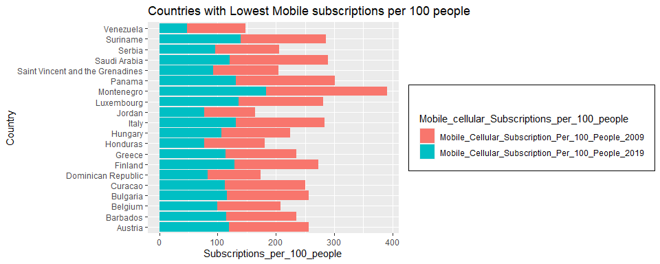

analysis\_of\_internet\_usage
================
Vasundhara Sharma
1/22/2022

# Reading the data files

``` r
# reading data files
df_broadband_penetration <- read.csv("data_files/broadband-penetration-by-country.csv", na.string = "")
df_mobile_subscription <- read.csv("data_files/mobile-cellular-subscriptions-per-100-people.csv", na.string = "")
df_internet_users <- read.csv("data_files/number-of-internet-users-by-country.csv")
df_share_indviduals_using_internet <- read.csv("data_files/share-of-individuals-using-the-internet.csv")
df_continents <- read.csv("data_files/continents2.csv")
df_political_indexes <- read.csv("data_files/country-index.csv")
```

# Understanding the data

``` r
str(df_broadband_penetration)
```

    ## 'data.frame':    4175 obs. of  4 variables:
    ##  $ Entity                                        : chr  "Afghanistan" "Afghanistan" "Afghanistan" "Afghanistan" ...
    ##  $ Code                                          : chr  "AFG" "AFG" "AFG" "AFG" ...
    ##  $ Year                                          : int  2004 2005 2006 2007 2008 2009 2010 2012 2013 2014 ...
    ##  $ Fixed.broadband.subscriptions..per.100.people.: num  0.000809 0.000858 0.001892 0.001845 0.001804 ...

``` r
knitr::kable(df_broadband_penetration %>%
               select(everything()) %>% 
               summarise_all(list(~sum(is.na(.)))),
             caption = 'Number of NULL values in each column')
```

<table>
<caption>
Number of NULL values in each column
</caption>
<thead>
<tr>
<th style="text-align:right;">
Entity
</th>
<th style="text-align:right;">
Code
</th>
<th style="text-align:right;">
Year
</th>
<th style="text-align:right;">
Fixed.broadband.subscriptions..per.100.people.
</th>
</tr>
</thead>
<tbody>
<tr>
<td style="text-align:right;">
0
</td>
<td style="text-align:right;">
800
</td>
<td style="text-align:right;">
0
</td>
<td style="text-align:right;">
0
</td>
</tr>
</tbody>
</table>

``` r
str(df_mobile_subscription)
```

    ## 'data.frame':    11895 obs. of  4 variables:
    ##  $ Entity                                        : chr  "Afghanistan" "Afghanistan" "Afghanistan" "Afghanistan" ...
    ##  $ Code                                          : chr  "AFG" "AFG" "AFG" "AFG" ...
    ##  $ Year                                          : int  1960 1965 1970 1975 1976 1977 1978 1979 1980 1981 ...
    ##  $ Mobile.cellular.subscriptions..per.100.people.: num  0 0 0 0 0 0 0 0 0 0 ...

``` r
knitr::kable(df_mobile_subscription %>%
               select(everything()) %>% 
               summarise_all(list(~sum(is.na(.)))),
             caption = 'Number of NULL values in each column')
```

<table>
<caption>
Number of NULL values in each column
</caption>
<thead>
<tr>
<th style="text-align:right;">
Entity
</th>
<th style="text-align:right;">
Code
</th>
<th style="text-align:right;">
Year
</th>
<th style="text-align:right;">
Mobile.cellular.subscriptions..per.100.people.
</th>
</tr>
</thead>
<tbody>
<tr>
<td style="text-align:right;">
0
</td>
<td style="text-align:right;">
2250
</td>
<td style="text-align:right;">
0
</td>
<td style="text-align:right;">
0
</td>
</tr>
</tbody>
</table>

``` r
str(df_internet_users)
```

    ## 'data.frame':    4536 obs. of  4 variables:
    ##  $ Entity                                          : chr  "Afghanistan" "Afghanistan" "Afghanistan" "Afghanistan" ...
    ##  $ Code                                            : chr  "AFG" "AFG" "AFG" "AFG" ...
    ##  $ Year                                            : int  1990 2001 2002 2003 2004 2005 2006 2007 2008 2009 ...
    ##  $ Number.of.internet.users..OWID.based.on.WB...UN.: num  0 990 1003 20272 25520 ...

``` r
knitr::kable(df_internet_users %>%
               select(everything()) %>% 
               summarise_all(list(~sum(is.na(.)))),
             caption = 'Number of NULL values in each column')
```

<table>
<caption>
Number of NULL values in each column
</caption>
<thead>
<tr>
<th style="text-align:right;">
Entity
</th>
<th style="text-align:right;">
Code
</th>
<th style="text-align:right;">
Year
</th>
<th style="text-align:right;">
Number.of.internet.users..OWID.based.on.WB…UN.
</th>
</tr>
</thead>
<tbody>
<tr>
<td style="text-align:right;">
0
</td>
<td style="text-align:right;">
0
</td>
<td style="text-align:right;">
0
</td>
<td style="text-align:right;">
0
</td>
</tr>
</tbody>
</table>

``` r
str(df_share_indviduals_using_internet)
```

    ## 'data.frame':    7119 obs. of  4 variables:
    ##  $ Entity                                          : chr  "Afghanistan" "Afghanistan" "Afghanistan" "Afghanistan" ...
    ##  $ Code                                            : chr  "AFG" "AFG" "AFG" "AFG" ...
    ##  $ Year                                            : int  1990 1991 1992 1993 1994 1995 2001 2002 2003 2004 ...
    ##  $ Individuals.using.the.Internet....of.population.: num  0 0 0 0 0 ...

``` r
knitr::kable(df_share_indviduals_using_internet %>%
               select(everything()) %>% 
               summarise_all(list(~sum(is.na(.)))),
             caption = 'Number of NULL values in each column')
```

<table>
<caption>
Number of NULL values in each column
</caption>
<thead>
<tr>
<th style="text-align:right;">
Entity
</th>
<th style="text-align:right;">
Code
</th>
<th style="text-align:right;">
Year
</th>
<th style="text-align:right;">
Individuals.using.the.Internet….of.population.
</th>
</tr>
</thead>
<tbody>
<tr>
<td style="text-align:right;">
0
</td>
<td style="text-align:right;">
0
</td>
<td style="text-align:right;">
0
</td>
<td style="text-align:right;">
0
</td>
</tr>
</tbody>
</table>

``` r
str(df_continents)
```

    ## 'data.frame':    249 obs. of  11 variables:
    ##  $ ï..name                 : chr  "Afghanistan" "Ã…land Islands" "Albania" "Algeria" ...
    ##  $ alpha.2                 : chr  "AF" "AX" "AL" "DZ" ...
    ##  $ alpha.3                 : chr  "AFG" "ALA" "ALB" "DZA" ...
    ##  $ country.code            : int  4 248 8 12 16 20 24 660 10 28 ...
    ##  $ iso_3166.2              : chr  "ISO 3166-2:AF" "ISO 3166-2:AX" "ISO 3166-2:AL" "ISO 3166-2:DZ" ...
    ##  $ region                  : chr  "Asia" "Europe" "Europe" "Africa" ...
    ##  $ sub.region              : chr  "Southern Asia" "Northern Europe" "Southern Europe" "Northern Africa" ...
    ##  $ intermediate.region     : chr  "" "" "" "" ...
    ##  $ region.code             : int  142 150 150 2 9 150 2 19 NA 19 ...
    ##  $ sub.region.code         : int  34 154 39 15 61 39 202 419 NA 419 ...
    ##  $ intermediate.region.code: int  NA NA NA NA NA NA 17 29 NA 29 ...

``` r
knitr::kable(df_continents %>%
               select(everything()) %>% 
               summarise_all(list(~sum(is.na(.)))),
             caption = 'Number of NULL values in each column')
```

<table>
<caption>
Number of NULL values in each column
</caption>
<thead>
<tr>
<th style="text-align:right;">
ï..name
</th>
<th style="text-align:right;">
alpha.2
</th>
<th style="text-align:right;">
alpha.3
</th>
<th style="text-align:right;">
country.code
</th>
<th style="text-align:right;">
iso\_3166.2
</th>
<th style="text-align:right;">
region
</th>
<th style="text-align:right;">
sub.region
</th>
<th style="text-align:right;">
intermediate.region
</th>
<th style="text-align:right;">
region.code
</th>
<th style="text-align:right;">
sub.region.code
</th>
<th style="text-align:right;">
intermediate.region.code
</th>
</tr>
</thead>
<tbody>
<tr>
<td style="text-align:right;">
0
</td>
<td style="text-align:right;">
1
</td>
<td style="text-align:right;">
0
</td>
<td style="text-align:right;">
0
</td>
<td style="text-align:right;">
0
</td>
<td style="text-align:right;">
0
</td>
<td style="text-align:right;">
0
</td>
<td style="text-align:right;">
0
</td>
<td style="text-align:right;">
1
</td>
<td style="text-align:right;">
1
</td>
<td style="text-align:right;">
142
</td>
</tr>
</tbody>
</table>

``` r
str(df_political_indexes)
```

    ## 'data.frame':    2501 obs. of  10 variables:
    ##  $ geo                            : chr  "afg" "afg" "afg" "afg" ...
    ##  $ name                           : chr  "Afghanistan" "Afghanistan" "Afghanistan" "Afghanistan" ...
    ##  $ year                           : int  2006 2007 2008 2009 2010 2011 2012 2013 2014 2015 ...
    ##  $ Democracy.Index                : num  30.6 30.4 30.2 27.5 24.8 24.8 24.8 24.8 27.7 27.7 ...
    ##  $ Electoral.process.and.pluralism: num  61.7 56.7 51.7 38.4 25 ...
    ##  $ Functioning.of.government      : num  0 3.95 7.9 7.9 7.9 7.9 7.9 7.9 11.4 11.4 ...
    ##  $ Political.participation        : num  22.2 22.2 22.2 25 27.8 27.8 27.8 27.8 38.9 38.9 ...
    ##  $ Political.culture              : num  25 25 25 25 25 25 25 25 25 25 ...
    ##  $ Civil.liberties                : num  44.1 44.1 44.1 41.1 38.2 ...
    ##  $ Change.in.democracy.index      : num  NA -0.2 -0.2 -2.7 -2.7 0 0 0 2.9 0 ...

``` r
knitr::kable(df_political_indexes %>%
               select(everything()) %>% 
               summarise_all(list(~sum(is.na(.)))),
             caption = 'Number of NULL values in each column')
```

<table>
<caption>
Number of NULL values in each column
</caption>
<thead>
<tr>
<th style="text-align:right;">
geo
</th>
<th style="text-align:right;">
name
</th>
<th style="text-align:right;">
year
</th>
<th style="text-align:right;">
Democracy.Index
</th>
<th style="text-align:right;">
Electoral.process.and.pluralism
</th>
<th style="text-align:right;">
Functioning.of.government
</th>
<th style="text-align:right;">
Political.participation
</th>
<th style="text-align:right;">
Political.culture
</th>
<th style="text-align:right;">
Civil.liberties
</th>
<th style="text-align:right;">
Change.in.democracy.index
</th>
</tr>
</thead>
<tbody>
<tr>
<td style="text-align:right;">
0
</td>
<td style="text-align:right;">
0
</td>
<td style="text-align:right;">
0
</td>
<td style="text-align:right;">
0
</td>
<td style="text-align:right;">
0
</td>
<td style="text-align:right;">
0
</td>
<td style="text-align:right;">
0
</td>
<td style="text-align:right;">
0
</td>
<td style="text-align:right;">
0
</td>
<td style="text-align:right;">
320
</td>
</tr>
</tbody>
</table>

# Renaming columns and fixing the political indexes

``` r
# renaming column names
colnames(df_broadband_penetration) <- c("Country", "Code", "Year", "Fixed_Broadband_Subscription_Per_100_People")
colnames(df_mobile_subscription) <- c("Country", "Code", "Year", "Mobile_Cellular_Subscription_Per_100_People")
colnames(df_internet_users) <- c("Country", "Code", "Year", "Number_Of_Internet_Users")
colnames(df_share_indviduals_using_internet) <- c("Country", "Code", "Year", "Percent_Of_People_Using_Internet")
colnames(df_political_indexes) <- c("Code", "Country", "Year", "Democracy_Index", "Electoral_Process_And_Pluralism", "Functioning_Of_Government", "Political_Participation", "Political_Culture", "Civil_Libterties", "Change_In_Democracy_Index")
colnames(df_continents) <- c("Country", "Alpha-2",  "Alpha-3",  "Country-code", "ISO_3166-2",   "Region",   "Sub-region", "Intermediate-region",    "Region-code",  "Sub-region-code", "Intermediate-region-code")

# fixing data
df_political_indexes$Democracy_Index = (as.numeric(df_political_indexes$Democracy_Index) / 10)
```

# Exploring and analyzing the data

``` r
knitr::kable(df_mobile_subscription %>%
             filter(Code != "") %>% 
             filter(Year == 2019) %>%
             select(Country, Code, Mobile_Cellular_Subscription_Per_100_People)%>%
             arrange(desc(Mobile_Cellular_Subscription_Per_100_People)) %>% top_n(5), 
             caption = "Countries With Maximum Mobile Subscription in 2019")
```

    ## Selecting by Mobile_Cellular_Subscription_Per_100_People

<table>
<caption>
Countries With Maximum Mobile Subscription in 2019
</caption>
<thead>
<tr>
<th style="text-align:left;">
Country
</th>
<th style="text-align:left;">
Code
</th>
<th style="text-align:right;">
Mobile\_Cellular\_Subscription\_Per\_100\_People
</th>
</tr>
</thead>
<tbody>
<tr>
<td style="text-align:left;">
Hong Kong
</td>
<td style="text-align:left;">
HKG
</td>
<td style="text-align:right;">
288.5327
</td>
</tr>
<tr>
<td style="text-align:left;">
United Arab Emirates
</td>
<td style="text-align:left;">
ARE
</td>
<td style="text-align:right;">
200.6321
</td>
</tr>
<tr>
<td style="text-align:left;">
Seychelles
</td>
<td style="text-align:left;">
SYC
</td>
<td style="text-align:right;">
198.1522
</td>
</tr>
<tr>
<td style="text-align:left;">
Thailand
</td>
<td style="text-align:left;">
THA
</td>
<td style="text-align:right;">
186.1586
</td>
</tr>
<tr>
<td style="text-align:left;">
Montenegro
</td>
<td style="text-align:left;">
MNE
</td>
<td style="text-align:right;">
183.2837
</td>
</tr>
</tbody>
</table>

``` r
knitr::kable(df_broadband_penetration %>%
             filter(Code != "") %>% 
             filter(Year == 2019) %>%
             select(Country, Code, Fixed_Broadband_Subscription_Per_100_People)%>%
             arrange(desc(Fixed_Broadband_Subscription_Per_100_People)) %>% top_n(5),
             caption = "Countries With Maximum Fixed Broadband Subscription in 2019")
```

    ## Selecting by Fixed_Broadband_Subscription_Per_100_People

<table>
<caption>
Countries With Maximum Fixed Broadband Subscription in 2019
</caption>
<thead>
<tr>
<th style="text-align:left;">
Country
</th>
<th style="text-align:left;">
Code
</th>
<th style="text-align:right;">
Fixed\_Broadband\_Subscription\_Per\_100\_People
</th>
</tr>
</thead>
<tbody>
<tr>
<td style="text-align:left;">
Gibraltar
</td>
<td style="text-align:left;">
GIB
</td>
<td style="text-align:right;">
57.85288
</td>
</tr>
<tr>
<td style="text-align:left;">
Monaco
</td>
<td style="text-align:left;">
MCO
</td>
<td style="text-align:right;">
52.55107
</td>
</tr>
<tr>
<td style="text-align:left;">
Andorra
</td>
<td style="text-align:left;">
AND
</td>
<td style="text-align:right;">
47.13126
</td>
</tr>
<tr>
<td style="text-align:left;">
Switzerland
</td>
<td style="text-align:left;">
CHE
</td>
<td style="text-align:right;">
46.90110
</td>
</tr>
<tr>
<td style="text-align:left;">
Malta
</td>
<td style="text-align:left;">
MLT
</td>
<td style="text-align:right;">
45.98680
</td>
</tr>
</tbody>
</table>

``` r
knitr::kable(df_internet_users %>%
             filter(Code != "") %>% 
             filter(Year == 2016) %>%
             select(Country, Code, Number_Of_Internet_Users)%>%
             arrange(desc(Number_Of_Internet_Users)) %>% top_n(5),
             caption = "Countries With Maximum Internet users in 2016")
```

    ## Selecting by Number_Of_Internet_Users

<table>
<caption>
Countries With Maximum Internet users in 2016
</caption>
<thead>
<tr>
<th style="text-align:left;">
Country
</th>
<th style="text-align:left;">
Code
</th>
<th style="text-align:right;">
Number\_Of\_Internet\_Users
</th>
</tr>
</thead>
<tbody>
<tr>
<td style="text-align:left;">
World
</td>
<td style="text-align:left;">
OWID\_WRL
</td>
<td style="text-align:right;">
3419398061
</td>
</tr>
<tr>
<td style="text-align:left;">
China
</td>
<td style="text-align:left;">
CHN
</td>
<td style="text-align:right;">
746662194
</td>
</tr>
<tr>
<td style="text-align:left;">
India
</td>
<td style="text-align:left;">
IND
</td>
<td style="text-align:right;">
391255067
</td>
</tr>
<tr>
<td style="text-align:left;">
United States
</td>
<td style="text-align:left;">
USA
</td>
<td style="text-align:right;">
245425910
</td>
</tr>
<tr>
<td style="text-align:left;">
Brazil
</td>
<td style="text-align:left;">
BRA
</td>
<td style="text-align:right;">
126403573
</td>
</tr>
</tbody>
</table>

``` r
knitr::kable(head(df_political_indexes %>%
             filter(Year == "2006") %>%
             select(Country, Democracy_Index) %>%
             arrange(desc(Democracy_Index)), 5),
             caption = "Countries With Maximum Democracy Indexes in 2006")
```

<table>
<caption>
Countries With Maximum Democracy Indexes in 2006
</caption>
<thead>
<tr>
<th style="text-align:left;">
Country
</th>
<th style="text-align:right;">
Democracy\_Index
</th>
</tr>
</thead>
<tbody>
<tr>
<td style="text-align:left;">
Sweden
</td>
<td style="text-align:right;">
9.88
</td>
</tr>
<tr>
<td style="text-align:left;">
Iceland
</td>
<td style="text-align:right;">
9.71
</td>
</tr>
<tr>
<td style="text-align:left;">
Netherlands
</td>
<td style="text-align:right;">
9.66
</td>
</tr>
<tr>
<td style="text-align:left;">
Norway
</td>
<td style="text-align:right;">
9.55
</td>
</tr>
<tr>
<td style="text-align:left;">
Denmark
</td>
<td style="text-align:right;">
9.52
</td>
</tr>
</tbody>
</table>

``` r
knitr::kable(head(df_political_indexes %>%
             filter(Year == "2006") %>%
             select(Country, Democracy_Index) %>%
             arrange(Democracy_Index), 5),
             caption = "Countries With Minimum Democracy Indexes in 2006")
```

<table>
<caption>
Countries With Minimum Democracy Indexes in 2006
</caption>
<thead>
<tr>
<th style="text-align:left;">
Country
</th>
<th style="text-align:right;">
Democracy\_Index
</th>
</tr>
</thead>
<tbody>
<tr>
<td style="text-align:left;">
North Korea
</td>
<td style="text-align:right;">
1.03
</td>
</tr>
<tr>
<td style="text-align:left;">
Central African Republic
</td>
<td style="text-align:right;">
1.61
</td>
</tr>
<tr>
<td style="text-align:left;">
Chad
</td>
<td style="text-align:right;">
1.65
</td>
</tr>
<tr>
<td style="text-align:left;">
Togo
</td>
<td style="text-align:right;">
1.75
</td>
</tr>
<tr>
<td style="text-align:left;">
Myanmar
</td>
<td style="text-align:right;">
1.77
</td>
</tr>
</tbody>
</table>

``` r
knitr::kable(head(df_political_indexes %>% 
             filter(Year == "2020") %>%
             select(Country, Democracy_Index) %>%
             arrange(desc(Democracy_Index)), 5),
             caption = "Countries With Maximum Democracy Indexes in 2020")
```

<table>
<caption>
Countries With Maximum Democracy Indexes in 2020
</caption>
<thead>
<tr>
<th style="text-align:left;">
Country
</th>
<th style="text-align:right;">
Democracy\_Index
</th>
</tr>
</thead>
<tbody>
<tr>
<td style="text-align:left;">
Norway
</td>
<td style="text-align:right;">
9.81
</td>
</tr>
<tr>
<td style="text-align:left;">
Iceland
</td>
<td style="text-align:right;">
9.37
</td>
</tr>
<tr>
<td style="text-align:left;">
Sweden
</td>
<td style="text-align:right;">
9.26
</td>
</tr>
<tr>
<td style="text-align:left;">
New Zealand
</td>
<td style="text-align:right;">
9.25
</td>
</tr>
<tr>
<td style="text-align:left;">
Canada
</td>
<td style="text-align:right;">
9.24
</td>
</tr>
</tbody>
</table>

``` r
knitr::kable(head(df_political_indexes %>%
             filter(Year == "2020") %>%
             select(Country, Democracy_Index) %>%
             arrange(Democracy_Index), 5),
             caption = "Countries With Minimum Democracy Indexes in 2020")
```

<table>
<caption>
Countries With Minimum Democracy Indexes in 2020
</caption>
<thead>
<tr>
<th style="text-align:left;">
Country
</th>
<th style="text-align:right;">
Democracy\_Index
</th>
</tr>
</thead>
<tbody>
<tr>
<td style="text-align:left;">
North Korea
</td>
<td style="text-align:right;">
1.08
</td>
</tr>
<tr>
<td style="text-align:left;">
Congo, Dem. Rep. 
</td>
<td style="text-align:right;">
1.13
</td>
</tr>
<tr>
<td style="text-align:left;">
Central African Republic
</td>
<td style="text-align:right;">
1.32
</td>
</tr>
<tr>
<td style="text-align:left;">
Syria
</td>
<td style="text-align:right;">
1.43
</td>
</tr>
<tr>
<td style="text-align:left;">
Chad
</td>
<td style="text-align:right;">
1.55
</td>
</tr>
</tbody>
</table>

``` r
options(repr.plot.width = 12, repr.plot.height = 8)
#Comparing the growth of Mobile Subscriptions from 2009 to 2019

#Removing the regions from the Country column to obtain only the countries
df_mobile_subscription_onlycountries <- df_mobile_subscription %>% filter(Code !=  "")

#The records for the year 2009
df_mobile_subscription_onlycountries_2009 <- df_mobile_subscription_onlycountries %>% filter(Year == 2009)

#The records for the year 2019
df_mobile_subscription_onlycountries_2019 <- df_mobile_subscription_onlycountries %>% filter(Year == 2019)

#Joining the tables to get the records for only 2009 and 2019
df_mobile_subscription_combined_2009_2019 <- inner_join(df_mobile_subscription_onlycountries_2009,
                                                        df_mobile_subscription_onlycountries_2019, 
                                                        by = c("Country", "Code"))

df_mobile_subscription_combined_change <- mutate(df_mobile_subscription_combined_2009_2019, 
                                                 Percentage_Change = ((Mobile_Cellular_Subscription_Per_100_People.y - Mobile_Cellular_Subscription_Per_100_People.x)))

#Figuring out the countries which have improved the most in a decade
df_mobile_subscription_combined_change_ordered <- df_mobile_subscription_combined_change %>%
                                                  arrange(desc(df_mobile_subscription_combined_change$Percentage_Change))

#Obtaining the top 10 countries to have improved the most
df_mobile_subscription_combined_change_ordered_top10 <- df_mobile_subscription_combined_change_ordered %>% head(20)

# renaming the columns
colnames(df_mobile_subscription_combined_change_ordered_top10)[4] <- "Mobile_Cellular_Subscription_Per_100_People_2009"
colnames(df_mobile_subscription_combined_change_ordered_top10)[6] <- "Mobile_Cellular_Subscription_Per_100_People_2019"

# pivoting the 2009 and 2019 columns 
df_mobile_subscription_for_plot <- pivot_longer(df_mobile_subscription_combined_change_ordered_top10,
                                                cols =c("Mobile_Cellular_Subscription_Per_100_People_2019",
                                                        "Mobile_Cellular_Subscription_Per_100_People_2009"),
                                                names_to = "Mobile_cellular_Subscriptions_per_100_people", 
                                                values_to = "Subscriptions_per_100_people")

# bar plot to visualize the top-10 countries
ggplot(df_mobile_subscription_for_plot, 
       aes(fill = Mobile_cellular_Subscriptions_per_100_people,
           x = Country,
           y = Subscriptions_per_100_people,
           group = Mobile_cellular_Subscriptions_per_100_people)) + 
  geom_bar(position = "dodge",
           stat = "identity") + 
  ggtitle("Countries with Highest Change of Mobile subscriptions per 100 people") + 
  theme(legend.box.background = element_rect(color = "black",
                                             size=0.5),
        legend.box.margin = margin(25, 6, 6, 6)) + 
  theme(axis.text.x = element_text(size=10, 
                                   angle=90,
                                   hjust = 0.95,
                                   vjust = 0.2)) 
```

<!-- -->

``` r
# figuring out the countries which have improved the lowest
df_mobile_subscription_combined_change_ordered_asc <- df_mobile_subscription_combined_change %>%
                                                      arrange(df_mobile_subscription_combined_change$Percentage_Change)

df_mobile_subscription_combined_change_ordered_bottom10 <- df_mobile_subscription_combined_change_ordered_asc %>% head(20)

colnames(df_mobile_subscription_combined_change_ordered_bottom10)[4] <- "Mobile_Cellular_Subscription_Per_100_People_2009"
colnames(df_mobile_subscription_combined_change_ordered_bottom10)[6] <- "Mobile_Cellular_Subscription_Per_100_People_2019"

df_mobile_subscription_for_plot_bottom10 <- pivot_longer(df_mobile_subscription_combined_change_ordered_bottom10,
                                                         cols = c("Mobile_Cellular_Subscription_Per_100_People_2019",
                                                                  "Mobile_Cellular_Subscription_Per_100_People_2009"),
                                                         names_to = "Mobile_cellular_Subscriptions_per_100_people", 
                                                         values_to = "Subscriptions_per_100_people")

# plotting a stacked Bar-Plot to visualize the bottom 10 countries
ggplot(df_mobile_subscription_for_plot_bottom10,
       aes(fill = Mobile_cellular_Subscriptions_per_100_people,
           x = Subscriptions_per_100_people,
           y = Country,
           group = Mobile_cellular_Subscriptions_per_100_people)) +
  geom_bar(position = "stack",
           stat="identity") + 
  ggtitle("Countries with Lowest Mobile subscriptions per 100 people") +
  theme(legend.box.background = element_rect(color="black", 
                                             size=0.5),
        legend.box.margin = margin(25, 6, 6, 6))
```

<!-- -->

``` r
# comparing the growth of broadband from 2009 to 2019

# removing the regions from the Entity column to obtain only the countries
df_broadband_penetration_onlycountries <- df_broadband_penetration %>% filter(Code !=  "")

# the records for the year 2009
df_broadband_penetration_onlycountries_2009 <- df_broadband_penetration_onlycountries %>% filter(Year == 2009)

# the records for the year 2019
df_broadband_penetration_onlycountries_2019 <- df_broadband_penetration_onlycountries %>% filter(Year == 2019)

# joining the tables to get the records for only 2009 and 2019
df_broadband_penetration_combined_2009_2019 <- inner_join(df_broadband_penetration_onlycountries_2009,
                                                          df_broadband_penetration_onlycountries_2019, 
                                                          by = c("Country", "Code"))

df_broadband_penetration_combined_change <- mutate(df_broadband_penetration_combined_2009_2019, 
                                                   Percentage_Change = ((Fixed_Broadband_Subscription_Per_100_People.y - Fixed_Broadband_Subscription_Per_100_People.x)))

# figuring out the countries which have improved the most in a decade
df_broadband_penetration_combined_change_ordered <- df_broadband_penetration_combined_change %>%
                                                    arrange(desc(df_broadband_penetration_combined_change$Percentage_Change))

# obtaining the top 10 countries to have improved the most
df_broadband_penetration_combined_change_ordered_top10 <- df_broadband_penetration_combined_change_ordered %>% head(20)

# renaming the columns
colnames(df_broadband_penetration_combined_change_ordered_top10)[4] <- "Fixed_Broadband_Subscription_Per_100_People_2009"
colnames(df_broadband_penetration_combined_change_ordered_top10)[6] <- "Fixed_Broadband_Subscription_Per_100_People_2019"

# pivoting the 2009 and 2019 columns 
df_broadband_penetration_for_plot <- pivot_longer(df_broadband_penetration_combined_change_ordered_top10,
                                                  cols = c("Fixed_Broadband_Subscription_Per_100_People_2019",
                                                           "Fixed_Broadband_Subscription_Per_100_People_2009"),
                                                  names_to = "Fixed_Broadband_Subscriptions_per_100_people", 
                                                  values_to = "Subscriptions_per_100_people")

# bar plot to visualize the top-10 countries
ggplot(df_broadband_penetration_for_plot,
       aes(fill = Fixed_Broadband_Subscriptions_per_100_people,
           x = Country,
           y = Subscriptions_per_100_people,
           group = Fixed_Broadband_Subscriptions_per_100_people)) +
  geom_bar(position = "dodge",
           stat = "identity") + 
  ggtitle("Countries with Highest Change of Broadband subscriptions per 100 people") +
  theme(legend.box.background = element_rect(color = "black",
                                             size = 0.5),
        legend.box.margin = margin(25, 6, 6, 6)) + 
  theme(axis.text.x = element_text(size = 10, 
                                   angle = 90,
                                   hjust = 0.95,
                                   vjust = 0.2)) 
```

<!-- -->

``` r
# figuring out the countries which have improved the lowest
df_broadband_penetration_combined_change_ordered_asc <- df_broadband_penetration_combined_change %>%
                                                        arrange(df_broadband_penetration_combined_change$Percentage_Change)

df_broadband_penetration_combined_change_ordered_bottom10 <- df_broadband_penetration_combined_change_ordered_asc %>% head(20)

colnames(df_broadband_penetration_combined_change_ordered_bottom10)[4] <- "Fixed_Broadband_Subscription_Per_100_People_2009"
colnames(df_broadband_penetration_combined_change_ordered_bottom10)[6] <- "Fixed_Broadband_Subscription_Per_100_People_2019"

df_broadband_penetration_for_plot_bottom10 <- pivot_longer(df_broadband_penetration_combined_change_ordered_bottom10,
                                                           cols = c("Fixed_Broadband_Subscription_Per_100_People_2019",
                                                                    "Fixed_Broadband_Subscription_Per_100_People_2009"),
                                                           names_to = "Fixed_Broadband_Subscriptions_per_100_people", 
                                                           values_to = "Subscriptions_per_100_people")

# plotting a stacked Bar-Plot to visualize the bottom 10 countries
ggplot(df_broadband_penetration_for_plot_bottom10,
       aes(fill = Fixed_Broadband_Subscriptions_per_100_people,
           x = Subscriptions_per_100_people,
           y = Country,
           group = Fixed_Broadband_Subscriptions_per_100_people))+
  geom_bar(position = "stack",
           stat = "identity") + 
  ggtitle("Countries with Lowest Broadband subscriptions per 100 people") +
  theme(legend.box.background = element_rect(color = "black", 
                                             size = 0.5),
        legend.box.margin = margin(25, 6, 6, 6))
```

<!-- -->

``` r
options(repr.plot.width = 25, repr.plot.height = 5)
# heatmap of df_mobile_subscription for 2009

# importing the world map
world_map <- map_data("world")

# merging the world map with the mobile subscriptions by country dataset
world_map = merge(world_map,
                  df_mobile_subscription_onlycountries_2009,
                  by.x = "region",
                  by.y = "Country")

# arranging the table on the basis of Mobile subscriptions per 100 people
df_mobile_subscription_onlycountries_top10 <- df_mobile_subscription_onlycountries %>% arrange(desc(Mobile_Cellular_Subscription_Per_100_People)) %>% head(10)

# plotting the heatmap of the world for the year 2009
ggplot(world_map, aes(map_id = region, 
                      fill = Mobile_Cellular_Subscription_Per_100_People)) + 
  geom_map(map = world_map, 
             size = 0.1) + 
  scale_fill_gradient(low = "#fff7bc", 
                      high = "#cc4c02", 
                      name = "Mobile Cellular Subscriptions Per 100 People") + 
  expand_limits(x = world_map$long, 
                y = world_map$lat) + 
  ggtitle("Mobile Cellular Subscriptions Per 100 People Throughout The World - 2009") +
  theme(legend.box.background = element_rect(color = "black", 
                                             size = 0.5),
        legend.box.margin = margin(25, 6, 6, 6))
```

<!-- -->

``` r
# heatmap of df_mobile_subscription for 2019
world_map <- map_data("world")
world_map = merge(world_map,
                  df_mobile_subscription_onlycountries_2019,
                  by.x = "region",
                  by.y = "Country")

df_mobile_subscription_onlycountries_top10 <- df_mobile_subscription_onlycountries %>% 
                                              arrange(desc(Mobile_Cellular_Subscription_Per_100_People)) %>% 
                                              head(10)

# plotting the heatmap of the world for the year 2019
ggplot(world_map, 
       aes(map_id = region, 
           fill = Mobile_Cellular_Subscription_Per_100_People)) + 
  geom_map(map = world_map, 
           size = 0.25) + 
  scale_fill_gradient(low = "#fff7bc", 
                      high = "#cc4c02", 
                      name = "Mobile Cellular Subscriptions Per 100 People") + 
  expand_limits(x = world_map$long, 
                y = world_map$lat) + 
  ggtitle("Mobile Cellular Subscriptions Per 100 People Throughout The World - 2019") +
  theme(legend.box.background = element_rect(color = "black", 
                                             size = 0.5),
        legend.box.margin = margin(25, 6, 6, 6))
```

<!-- -->

``` r
knitr::opts_chunk$set(warning = FALSE, message = FALSE) 

# heatmap of df_broadband_penetration for 2009

# importing the world map
world_map <- map_data("world")

# merging the world map with the broadband penetration by country dataset
world_map = merge(world_map,df_broadband_penetration_onlycountries_2009,
                  by.x = "region",
                  by.y = "Country")

# arranging the table on the basis of Fixed Broadband subscriptions per 100 people
df_broadband_penetration_onlycountries_top10 <- df_broadband_penetration_onlycountries %>%
                                                arrange(desc(Fixed_Broadband_Subscription_Per_100_People)) %>% head(10)

# plotting the heatmap of the world for the year 2009
ggplot(world_map, 
       aes(map_id = region, 
           fill = Fixed_Broadband_Subscription_Per_100_People)) + 
  geom_map(map = world_map, 
           size = 0.1) + 
  scale_fill_gradient(low = "#fff7bc", 
                      high = "#cc4c02", 
                      name = "Fixed Broadband Subscriptions Per 100 People") + 
  expand_limits(x = world_map$long, 
                y = world_map$lat) + 
  ggtitle("Broadband Subscriptions Per 100 People Throughout the World – 2009") +
  theme(legend.box.background = element_rect(color = "black", 
                                             size = 0.5),
        legend.box.margin = margin(25, 6, 6, 6))
```

<!-- -->

``` r
# heatmap of df_broadband_penetration for 2019
world_map <- map_data("world")
world_map = merge(world_map,df_broadband_penetration_onlycountries_2019,
                  by.x = "region",
                  by.y = "Country")
df_broadband_penetration_onlycountries_top10 <- df_broadband_penetration_onlycountries %>%
                                                arrange(desc(Fixed_Broadband_Subscription_Per_100_People)) %>% head(10)

# plotting the heatmap of the world for the year 2019
ggplot(world_map, 
       aes(map_id = region, 
           fill = Fixed_Broadband_Subscription_Per_100_People)) + 
  geom_map(map = world_map, 
           size = 0.1) + 
  scale_fill_gradient(low = "#fff7bc", 
                      high = "#cc4c02", 
                      name = "Fixed Broadband Subscriptions Per 100 People") +
  expand_limits(x = world_map$long, 
                y = world_map$lat) + 
  ggtitle("Broadband Subscriptions Per 100 People Throughout the World – 2019") +
  theme(legend.box.background = element_rect(color = "black", 
                                             size=0.5),
        legend.box.margin = margin(6, 6, 6, 6))
```

<!-- -->

``` r
options(repr.plot.width = 12, repr.plot.height = 8)

# filtering the Broadband Penetration Dataset for the year 2019
df_broadband_penetration_2019 <- df_broadband_penetration %>% filter(Year == 2019)

#Filtering the Mobile Cellular Dataset for the year 2019
df_mobile_subscription_2019 <- df_mobile_subscription %>% filter(Code !=  "") %>% filter(Year == 2019)

# df_broadband_penetration and Continents
# joining the Broadband Penetration and Continents dataset using Country as the primary Key
df_broadband_penetration_continents <- inner_join(df_broadband_penetration_2019,
                                                  df_continents,
                                                  by = "Country")

# grouping the dataset on the basis of region
df_broadband_penetration_continents_grouped <- df_broadband_penetration_continents %>% 
                                               group_by(Region) %>% 
                                              summarise(Mean_Broadband_Subscriptions_Per_100_people =
                                                          mean(Fixed_Broadband_Subscription_Per_100_People))

head(df_broadband_penetration_continents_grouped)
```

    ## # A tibble: 5 x 2
    ##   Region   Mean_Broadband_Subscriptions_Per_100_people
    ##   <chr>                                          <dbl>
    ## 1 Africa                                          2.81
    ## 2 Americas                                       16.3 
    ## 3 Asia                                           13.8 
    ## 4 Europe                                         34.4 
    ## 5 Oceania                                         8.23

``` r
# plotting the Pie-Chart for df_broadband_penetration for different regions
ggplot(df_broadband_penetration_continents_grouped,
       aes(x = "",
           y = Mean_Broadband_Subscriptions_Per_100_people,
           fill = Region)) + 
  geom_bar(stat = "identity", 
           width=1) +
  coord_polar("y", 
              start=0) + 
  theme_void() +
  ggtitle("Mean Broadband Subscriptions Per 100 People \nAcross different Regions of the World") + 
  theme(plot.title = element_text(hjust = 0.3,
                                  size = 15,
                                  face = "bold")) +
  guides(fill  = guide_legend(reverse = TRUE)) +
  scale_fill_brewer(name = "Regions") + 
  theme(legend.text = element_text(size=10),
        legend.title = element_text(hjust = 0.5,
                                    size = 10,
                                    face = "bold")) + 
    geom_text(aes(label = paste0(round(df_broadband_penetration_continents_grouped$Mean_Broadband_Subscriptions_Per_100_people,
                                       digits = 2))),
              position = position_stack(vjust = 0.5),
              size = 3,
              face = "bold") + 
    theme(legend.box.background = element_rect(color = "black", 
                                               size = 1),
          legend.box.margin = margin(25, 6, 6, 6))
```

<!-- -->

``` r
# df_mobile_subscription and Democracy of Countries
df_mobile_subscription_continents <- inner_join(df_mobile_subscription_2019,df_continents,by="Country")

df_mobile_subscription_continents_grouped <- df_mobile_subscription_continents %>% 
                                             group_by(Region) %>% 
                                             summarise(Mean_cellular_Subscriptions_Per_100_people = 
                                                         mean(Mobile_Cellular_Subscription_Per_100_People))

head(df_mobile_subscription_continents_grouped)
```

    ## # A tibble: 5 x 2
    ##   Region   Mean_cellular_Subscriptions_Per_100_people
    ##   <chr>                                         <dbl>
    ## 1 Africa                                         92.8
    ## 2 Americas                                      106. 
    ## 3 Asia                                          128. 
    ## 4 Europe                                        122. 
    ## 5 Oceania                                        75.3

``` r
# plotting the Pie-Chart for df_mobile_subscription for different regions
ggplot(df_mobile_subscription_continents_grouped,
       aes(x = "",
           y = Mean_cellular_Subscriptions_Per_100_people,
           fill = Region)) + 
  geom_bar(stat = "identity", 
           width = 1) +
  coord_polar("y", 
              start = 0) + 
  theme_void() + 
  ggtitle("Mean Cellular Subscriptions Per 100 People \nAcross different Regions of the World") + 
  theme(plot.title = element_text(hjust = 0.3,
                                  size = 15,
                                  face = "bold")) +
  guides(fill  = guide_legend(reverse = TRUE))+
  scale_fill_brewer(name = "Regions") + 
  theme(legend.text = element_text(size=10),
        legend.title = element_text(hjust = 0.5,
                                    size = 10,
                                    face = "bold")) + 
    geom_text(aes(label = paste0(round(df_mobile_subscription_continents_grouped$Mean_cellular_Subscriptions_Per_100_people,
                                       digits = 2))),
              position = position_stack(vjust = 0.5),
              size = 3,
              face = "bold") + 
    theme(legend.box.background = element_rect(color="black", size=1),
          legend.box.margin = margin(25, 6, 6, 6))
```

<!-- -->

``` r
# options(repr.plot.width = 18, repr.plot.height = 20)

# joining data set
df_political_index_broadband_penetration <- merge(x = df_broadband_penetration, y = df_political_indexes, by = c("Country", "Year"))


# Democracy Index VS Fixed Broadband Subscription Per 100 People
df_democracy_index_broadband_penetration <- df_political_index_broadband_penetration %>% select(Country, Year, Democracy_Index, Fixed_Broadband_Subscription_Per_100_People)

plt_demo_indx_2006 <- df_democracy_index_broadband_penetration %>% filter(Year == "2006") %>%
  ggplot(aes(x = Democracy_Index, y = Fixed_Broadband_Subscription_Per_100_People)) + 
  geom_point(color = "deepskyblue") + 
  xlim(1,11) +
  ylim(0,50) +
  scale_x_continuous(breaks = c(2,4,6,8,10)) +
  theme_minimal() + 
  geom_smooth(method = "lm", formula = y ~ poly(x, 3), se = FALSE, color = "deeppink") +
  ggtitle("Democracy Index VS Fixed Broadband Subscription Per 100 People \n(2006)") + 
  labs(x = "Democracy Index", y = "Fixed Broadbad Subscription \nPer 100 People") + 
  theme(plot.title = element_text(size = 10, hjust = 0.5, face="italic"), legend.position = "none", axis.title = element_text(size = 8), axis.text = element_text(size = 5)) +
  geom_vline(xintercept = 1) +
  geom_hline(yintercept = 0) +
  annotate("rect", xmin=7.5, xmax=10, ymin=20, ymax= 32, fill=NA, color="grey40") +
  annotate("text", color="grey40", x=5.6, y=30, label="Countries with high democracy index \nand boradband subscriptions", size = 4, face = "bold")

plt_demo_indx_2008 <- df_democracy_index_broadband_penetration %>% filter(Year == "2008") %>%
  ggplot(aes(x = Democracy_Index, y = Fixed_Broadband_Subscription_Per_100_People)) + 
  geom_point(color = "deepskyblue") + 
  xlim(1,11) +
  ylim(0,50) +
  scale_x_continuous(breaks = c(2,4,6,8,10)) +
  theme_minimal() + 
  geom_smooth(method = "lm", formula = y ~ poly(x, 3), se = FALSE, color = "deeppink") +
  ggtitle("Democracy Index VS Fixed Broadband Subscription Per 100 People \n(2008)") + 
  labs(x = "Democracy Index", y = "Fixed Broadbad Subscription \nPer 100 People") + 
  theme(plot.title = element_text(size = 10, hjust = 0.5, face="italic"), legend.position = "none", axis.title = element_text(size = 8), axis.text = element_text(size = 5)) +      
  geom_vline(xintercept = 1) +
  geom_hline(yintercept = 0)


plt_demo_indx_2010 <- df_democracy_index_broadband_penetration %>% filter(Year == "2010") %>%
  ggplot(aes(x = Democracy_Index, y = Fixed_Broadband_Subscription_Per_100_People)) + 
  geom_point(color = "deepskyblue") + 
  xlim(1,11) +
  ylim(0,50) +
  scale_x_continuous(breaks = c(2,4,6,8,10)) +
  theme_minimal() + 
  geom_smooth(method = "lm", formula = y ~ poly(x, 3), se = FALSE, color = "deeppink") +
  ggtitle("Democracy Index VS Fixed Broadband Subscription Per 100 People \n(2010)") + 
  labs(x = "Democracy Index", y = "Fixed Broadbad Subscription \nPer 100 People") + 
  theme(plot.title = element_text(size = 10, hjust = 0.5, face="italic"), legend.position = "none", axis.title = element_text(size = 8), axis.text = element_text(size = 5)) +
  geom_vline(xintercept = 1) +
  geom_hline(yintercept = 0)

plt_demo_indx_2012 <- df_democracy_index_broadband_penetration %>% filter(Year == "2012") %>%
  ggplot(aes(x = Democracy_Index, y = Fixed_Broadband_Subscription_Per_100_People)) + 
  geom_point(color = "deepskyblue") +
  xlim(1,11) +
  ylim(0,50) +
  scale_x_continuous(breaks = c(2,4,6,8,10)) +
  theme_minimal() + 
  geom_smooth(method = "lm", formula = y ~ poly(x, 3), se = FALSE, color = "deeppink") +
  ggtitle("Democracy Index VS Fixed Broadband Subscription Per 100 People \n(2012)") + 
  labs(x = "Democracy Index", y = "Fixed Broadbad Subscription \nPer 100 People") + 
  theme(plot.title = element_text(size = 10, hjust = 0.5, face="italic"), legend.position = "none", axis.title = element_text(size = 8), axis.text = element_text(size = 5)) +
  geom_vline(xintercept = 1) +
  geom_hline(yintercept = 0)

plt_demo_indx_2014 <- df_democracy_index_broadband_penetration %>% filter(Year == "2014") %>%
  ggplot(aes(x = Democracy_Index, y = Fixed_Broadband_Subscription_Per_100_People)) + 
  geom_point(color = "deepskyblue") + 
  xlim(1,11) +
  ylim(0,50) +
  scale_x_continuous(breaks = c(2,4,6,8,10)) +
  theme_minimal() + 
  geom_smooth(method = "lm", formula = y ~ poly(x, 3), se = FALSE, color = "deeppink") +
  ggtitle("Democracy Index VS Fixed Broadband Subscription Per 100 People \n(2014)") + 
  labs(x = "Democracy Index", y = "Fixed Broadbad Subscription \nPer 100 People") + 
  theme(plot.title = element_text(size = 10, hjust = 0.5, face="italic"), legend.position = "none", axis.title = element_text(size = 8), axis.text = element_text(size = 5)) +
  geom_vline(xintercept = 1) +
  geom_hline(yintercept = 0)

plt_demo_indx_2018 <- df_democracy_index_broadband_penetration %>% filter(Year == "2018") %>%
  ggplot(aes(x = Democracy_Index, y = Fixed_Broadband_Subscription_Per_100_People)) + 
  geom_point(color = "deepskyblue") + 
  xlim(1,11) +
  ylim(0,50) +
  scale_x_continuous(breaks = c(2,4,6,8,10)) +
  theme_minimal() + 
  geom_smooth(method = "lm", formula = y ~ poly(x, 3), se = FALSE, color = "deeppink") +
  ggtitle("Democracy Index VS Fixed Broadband Subscription Per 100 People \n(2018)") + 
  labs(x = "Democracy Index", y = "Fixed Broadbad Subscription \nPer 100 People") + 
  theme(plot.title = element_text(size = 10, hjust = 0.5, face="italic"), legend.position = "none", axis.title = element_text(size = 8), axis.text = element_text(size = 5)) +
  geom_vline(xintercept = 1) +
  geom_hline(yintercept = 0)

grid.arrange(plt_demo_indx_2006, plt_demo_indx_2008, plt_demo_indx_2010, plt_demo_indx_2012, plt_demo_indx_2014, plt_demo_indx_2018, nrow = 3)
```

<!-- -->


``` r
# calculating correlation coefficient 
print(paste("Correlation Coefficiant:", 
            cor(df_democracy_index_broadband_penetration$Democracy_Index, df_democracy_index_broadband_penetration$Fixed_Broadband_Subscription_Per_100_People)))
```

    ## [1] "Correlation Coefficiant: 0.653504831919655"

``` r
# Functioning of Government VS Fixed Broadband Subscription Per 100 People
df_func_govt_broadband_penetration <- df_political_index_broadband_penetration %>% select(Country, Year, Functioning_Of_Government, Fixed_Broadband_Subscription_Per_100_People)

plt_func_govt_2006 <- df_func_govt_broadband_penetration %>% filter(Year == "2006") %>%
  ggplot(aes(x = Functioning_Of_Government, y = Fixed_Broadband_Subscription_Per_100_People)) + 
  geom_point(color = "limegreen") + 
  xlim(0,100) +
  ylim(0,50) +
  theme_minimal() + 
  geom_smooth(method = "lm", formula = y ~ poly(x, 3), se = FALSE, color = "palevioletred") +
  ggtitle("Functioning Of Government VS Fixed Broadband Subscription \nPer 100 People (2006)") + 
  labs(x = "Functioning Of Government", y = "Fixed Broadbad Subscription \nPer 100 People") + 
  theme(plot.title = element_text(size = 10, hjust = 0.5, face="italic"), legend.position = "none", axis.title = element_text(size = 8), axis.text = element_text(size = 5)) +
  geom_vline(xintercept = 0) +
  geom_hline(yintercept = 0)


plt_func_govt_2008 <- df_func_govt_broadband_penetration %>% filter(Year == "2008") %>%
  ggplot(aes(x = Functioning_Of_Government, y = Fixed_Broadband_Subscription_Per_100_People)) + 
  geom_point(color = "limegreen") + 
  xlim(0,100) +
  ylim(0,50) +
  theme_minimal() + 
  geom_smooth(method = "lm", formula = y ~ poly(x, 3), se = FALSE, color = "palevioletred") +
  ggtitle("Functioning Of Government VS Fixed Broadband Subscription \nPer 100 People (2008)") + 
  labs(x = "Functioning Of Government", y = "Fixed Broadbad Subscription \nPer 100 People") + 
  theme(plot.title = element_text(size = 10, hjust = 0.5, face="italic"), legend.position = "none", axis.title = element_text(size = 8), axis.text = element_text(size = 5)) +       
  geom_vline(xintercept = 0) +
  geom_hline(yintercept = 0)


plt_func_govt_2010 <- df_func_govt_broadband_penetration %>% filter(Year == "2010") %>%
  ggplot(aes(x = Functioning_Of_Government, y = Fixed_Broadband_Subscription_Per_100_People)) + 
  geom_point(color = "limegreen") + 
  xlim(0,100) +
  ylim(0,50) +
  theme_minimal() + 
  geom_smooth(method = "lm", formula = y ~ poly(x, 3), se = FALSE, color = "palevioletred") +
  ggtitle("Functioning Of Government VS Fixed Broadband Subscription \nPer 100 People (2010)") + 
  labs(x = "Functioning Of Government", y = "Fixed Broadbad Subscription \nPer 100 People") + 
  theme(plot.title = element_text(size = 10, hjust = 0.5, face="italic"), legend.position = "none", axis.title = element_text(size = 8), axis.text = element_text(size = 5)) +
  geom_vline(xintercept = 0) +
  geom_hline(yintercept = 0)


plt_func_govt_2012 <- df_func_govt_broadband_penetration %>% filter(Year == "2012") %>%
  ggplot(aes(x = Functioning_Of_Government, y = Fixed_Broadband_Subscription_Per_100_People)) + 
  geom_point(color = "limegreen") + 
  xlim(0,100) +
  ylim(0,50) +
  theme_minimal() + 
  geom_smooth(method = "lm", formula = y ~ poly(x, 3), se = FALSE, color = "palevioletred") +
  ggtitle("Functioning Of Government VS Fixed Broadband Subscription \nPer 100 People (2012)") + 
  labs(x = "Functioning Of Government", y = "Fixed Broadbad Subscription \nPer 100 People") + 
  theme(plot.title = element_text(size = 10, hjust = 0.5, face="italic"), legend.position = "none", axis.title = element_text(size = 8), axis.text = element_text(size = 5)) +
  geom_vline(xintercept = 0) +
  geom_hline(yintercept = 0)


plt_func_govt_2014 <- df_func_govt_broadband_penetration %>% filter(Year == "2014") %>%
  ggplot(aes(x = Functioning_Of_Government, y = Fixed_Broadband_Subscription_Per_100_People)) + 
  geom_point(color = "limegreen") + 
  xlim(0,100) +
  ylim(0,50) +
  theme_minimal() + 
  geom_smooth(method = "lm", formula = y ~ poly(x, 3), se = FALSE, color = "palevioletred") +
  ggtitle("Functioning Of Government VS Fixed Broadband Subscription \nPer 100 People (2014)") + 
  labs(x = "Functioning Of Government", y = "Fixed Broadbad Subscription \nPer 100 People") + 
  theme(plot.title = element_text(size = 10, hjust = 0.5, face="italic"), legend.position = "none", axis.title = element_text(size = 8), axis.text = element_text(size = 5)) +
  geom_vline(xintercept = 0) +
  geom_hline(yintercept = 0)

plt_func_govt_2018 <- df_func_govt_broadband_penetration %>% filter(Year == "2018") %>%
  ggplot(aes(x = Functioning_Of_Government, y = Fixed_Broadband_Subscription_Per_100_People)) + 
  geom_point(color = "limegreen") + 
  xlim(0,100) +
  ylim(0,50) +
  theme_minimal() + 
  geom_smooth(method = "lm", formula = y ~ poly(x, 3), se = FALSE, color = "palevioletred") +
  ggtitle("Functioning Of Government VS Fixed Broadband Subscription \nPer 100 People (2018)") + 
  labs(x = "Functioning Of Government", y = "Fixed Broadbad Subscription \nPer 100 People") + 
  theme(plot.title = element_text(size = 10, hjust = 0.5, face="italic"), legend.position = "none", axis.title = element_text(size = 8), axis.text = element_text(size = 5)) +
  geom_vline(xintercept = 0) +
  geom_hline(yintercept = 0)


grid.arrange(plt_func_govt_2006, plt_func_govt_2008, plt_func_govt_2010, plt_func_govt_2012, plt_func_govt_2014, plt_func_govt_2018, nrow = 3)
```

<!-- -->


``` r
# calculating correlation coefficient
print(paste("Correlation Coefficiant:", 
            cor(df_political_index_broadband_penetration$Functioning_Of_Government, df_democracy_index_broadband_penetration$Fixed_Broadband_Subscription_Per_100_People)))
```

    ## [1] "Correlation Coefficiant: 0.635319749543323"
